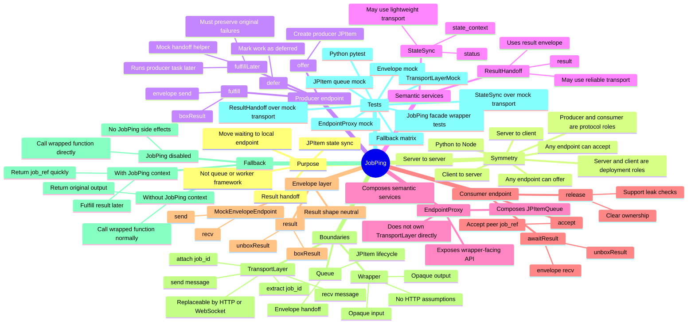

# JobPing

JobPing is a small endpoint rendezvous bridge for `JPItem` state synchronization and result handoff. It is not a queue system, worker framework, scheduler, or background job platform.

The core goal is narrow: move necessary waiting away from a remote application connection and onto a local endpoint wait point, while preserving the wrapped service's original input, output, and failure semantics.

## Examples layout

The current runnable control group, evolving JobPing example implementation, and their regression tests live under `examples/`:

- `examples/control_group/`: baseline FastAPI + JavaScript client behavior without JobPing.
- `examples/experiment_group/`: the current expected JobPing shape, including `JobPing`, `EndpointProxy`, `StateSync`, `ResultHandoff`, and `TransportLayer`.
- `examples/tests/`: tests for both examples and the current semantic-layer contracts.

## Current design lens

The important symmetry is not `server` versus `client`. Those are deployment roles. The protocol role that matters is whether an endpoint is producing a value later or waiting for a peer to produce it.

An endpoint may be a producer in one interaction and a consumer in another:

- browser/client waits for server result
- server waits for browser/client-provided content
- server waits for server
- Python waits for Node, or Node waits for Python

This means JobPing APIs should avoid server/client-specific names where the behavior is actually symmetric.

## JPItem queue semantics

The current mock API uses producer/consumer rendezvous names:

| Role | Flow | Meaning |
|---|---|---|
| Producer endpoint | `offer -> defer -> fulfill` | This endpoint promises to produce a result later, optionally defers work, then fulfills the `JPItem`. |
| Consumer endpoint | `accept -> awaitResult -> release` | This endpoint accepts a peer's `job_ref`, waits for fulfillment, then releases local ownership. |

Preferred public vocabulary:

- `offer(job_id)`: create a producer-side `JPItem`.
- `accept(job_id)`: create a consumer-side `JPItem` from a peer offer.
- `defer(job_id | item)`: mark an offered item as deferred work.
- `makeJobRef(job_id)` / `make_job_ref(job_id)`: create wrapper-facing rendezvous signaling for an offered job.
- `isJobRef(value)` / `is_job_ref(value)`: detect wrapper-facing job references without treating them as result envelopes.
- `fulfill(job_id, result)`: box and send the result through the result handoff layer.
- `fulfillLater(job_id, task)` / `fulfill_later(job_id, task)`: run producer work through the proxy handoff helper and fulfill the item.
- `awaitResult(job_id)` / `await_result(job_id)`: wait for a result envelope and unbox it.
- `release(job_id)`: remove endpoint ownership once the item is no longer needed.

`fulfillLater` is intentionally still a mock-level helper. It records the intended producer-work-to-result-handoff semantics without locking down the final scheduler API.

## Semantic services and transport

JobPing separates semantic services from transport mechanisms:

| Layer | Responsibility |
|---|---|
| `StateSync` | Synchronizes `job_id + status + state_context`. |
| `ResultHandoff` | Transfers `job_id + result` ownership/availability. |
| `TransportLayer` | Moves messages through HTTP, WebSocket, SSE+POST, Kafka, Redis, RabbitMQ, or another carrier. |

`StateSync` and `ResultHandoff` are peers. They may share one transport implementation, but they do not have to. Status updates are often lightweight and frequent, while result handoff may need stronger reliability, larger payload support, or a different storage/retrieval path.

Current semantic operations:

- `StateSync.publish(job_id, status, state_context)`
- `StateSync.waitFor/wait_for(job_id, status=...)`
- `ResultHandoff.fulfill(job_id, result)`
- `ResultHandoff.awaitResult/await_result(job_id)`

## JobPing facade

`JobPing` is the top-level wrapper facade. Its public surface is intentionally small: `wrap(...)`.

Current role-specific behavior lives at the facade edge:

- client-side `JobPing.wrap(callable)` calls the opaque callable, detects a returned `job_ref`, then uses `EndpointProxy` to `accept -> awaitResult -> release`.
- server-side `JobPing.wrap()(callable)` inspects the injected job context provider; with a job context it `offer -> defer -> fulfill_later` and returns a `job_ref`, otherwise it calls the opaque callable normally.

The facade depends on `EndpointProxy`, not directly on `TransportLayer`, `StateSync`, or `ResultHandoff`.

## EndpointProxy composition

`EndpointProxy` is the upper-level composition root used by wrappers. It does not receive a `TransportLayer` directly. Instead, transport is injected into semantic services first, then those semantic-service instances are injected into `EndpointProxy`.

```python
state_sync = StateSync(transport_layer=status_transport)
result_handoff = ResultHandoff(transport_layer=result_transport)

endpoint_proxy = EndpointProxy(
    state_sync=state_sync,
    result_handoff=result_handoff,
    queue=jpitem_queue,
    create_job_id=create_job_id,
)
```

This keeps the dependency direction clean:

```text
wrapper -> EndpointProxy -> StateSync / ResultHandoff / JPItemQueue
                            StateSync / ResultHandoff -> TransportLayer
```

Current EndpointProxy operations:

- `createJobId` / `create_job_id`
- `makeJobRef` / `make_job_ref`
- `isJobRef` / `is_job_ref`
- `offer`
- `accept`
- `defer`
- `publishState` / `publish_state`
- `waitForState` / `wait_for_state`
- `fulfill`
- `fulfillLater` / `fulfill_later`
- `awaitResult` / `await_result`
- `release`

## Envelope mock semantics

The envelope layer is result-shape-neutral. It does not know HTTP, WebSocket, FastAPI, fetch, routing, status state machines, or any business-specific result shape.

Current result envelope operations:

- `boxResult` / `box_result`
- `isEnvelope` / `is_envelope`
- `isResultEnvelope` / `is_result_envelope`
- `unboxResult` / `unbox_result`
- `MockEnvelopeEndpoint.send`
- `MockEnvelopeEndpoint.recv`

`job_ref` and routing belong closer to `TransportLayer`/`EndpointProxy` signaling than to result envelope semantics.

## Job IDs and transport layers

`job_id` generation is not mocked. Current JavaScript and Python helpers use UUID v4 directly.

`TransportLayer` is now the formal abstract boundary for moving JobPing metadata and semantic-service messages. It remains deliberately thin: it does not manage JPItem lifecycle or inspect business results. `TransportLayerMock` is the current concrete test implementation, using header-like metadata and in-memory message queues:

- `attachJobId` / `attach_job_id`
- `extractJobId` / `extract_job_id`
- `attachEnvelope` / `attach_envelope`
- `extractEnvelope` / `extract_envelope`
- `sendEnvelope` / `send_envelope`
- `recvEnvelope` / `recv_envelope`
- `sendMessage` / `send_message`
- `recvMessage` / `recv_message`

A real HTTP, WebSocket, SSE+POST, Kafka, Redis, or RabbitMQ `TransportLayer` subclass should be able to replace this mock without changing StateSync, ResultHandoff, queue, or envelope semantics.

## Failure semantics

JobPing should not convert producer exceptions into success-shaped payloads.

The principle is: if the wrapped service would have failed before JobPing, it should still fail after JobPing. JobPing may move where waiting happens, but it must not become a silent node that swallows, normalizes, or prettifies producer failures.

That means future execution semantics must preserve the original failure behavior rather than inventing an `{"status": "ERROR"}` result payload unless the wrapped application itself produced that payload.

## Unload switch

JobPing follows a scout rule: adding it should not make the system harder to debug. If a JobPing boundary exception is confusing, developers should be able to unload JobPing and compare against the original call path.

Current mock unload controls:

- Python/server side: set `JOBPING_DISABLED=1`.
- JavaScript side: set `JOBPING_DISABLED=1` or `globalThis.__JOBPING_DISABLED__ = true`.

When disabled at the `wrap` entry point, JobPing performs no capture, envelope, JPItem, print, or queue behavior. It calls the wrapped callable directly.

## Mermaid mind map



## Current test command

Run the full mock regression suite:

```bash
npm test
```

This currently runs:

- envelope mock tests
- JPItem queue mock tests
- TransportLayerMock tests
- StateSync tests over mock transport
- ResultHandoff tests over mock transport
- EndpointProxy tests
- wrapper integration mock tests
- unload switch tests
- control/experiment fallback matrix
- Python pytest tests
