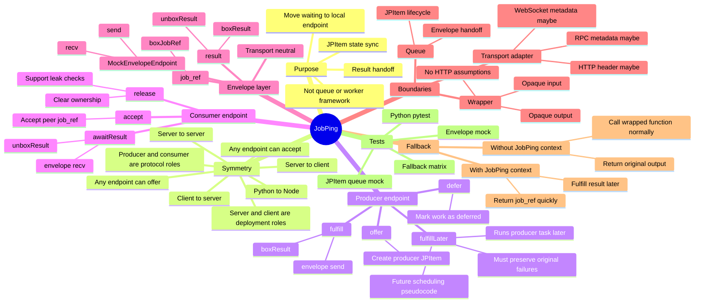

# JobPing

JobPing is a small endpoint rendezvous bridge for `JPItem` state synchronization and result handoff. It is not a queue system, worker framework, scheduler, or background job platform.

The core goal is narrow: move necessary waiting away from a remote application connection and onto a local endpoint wait point, while preserving the wrapped service's original input, output, and failure semantics.

## Current design lens

The important symmetry is not `server` versus `client`. Those are deployment roles. The protocol role that matters is whether an endpoint is producing a value later or waiting for a peer to produce it.

An endpoint may be a producer in one interaction and a consumer in another:

- browser/client waits for server result
- server waits for browser/client-provided content
- server waits for server
- Python waits for Node, or Node waits for Python

This means JobPing APIs should avoid server/client-specific names where the behavior is actually symmetric.

## JPItem queue semantics

The current mock API uses producer/consumer rendezvous names:

| Role | Flow | Meaning |
|---|---|---|
| Producer endpoint | `offer -> defer -> fulfill` | This endpoint promises to produce a result later, optionally defers work, then fulfills the `JPItem`. |
| Consumer endpoint | `accept -> awaitResult -> release` | This endpoint accepts a peer's `job_ref`, waits for fulfillment, then releases local ownership. |

Preferred public vocabulary:

- `offer(job_id)`: create a producer-side `JPItem`.
- `accept(job_id)`: create a consumer-side `JPItem` from a peer offer.
- `defer(job_id | item)`: mark an offered item as deferred work.
- `fulfill(job_id, payload)`: box and send the result through the envelope layer.
- `fulfillLater(job_id, task)`: future pseudocode for running producer work later and then fulfilling the item.
- `awaitResult(job_id)` / `await_result(job_id)`: wait for a result envelope and unbox it.
- `release(job_id)`: remove endpoint ownership once the item is no longer needed.

`fulfillLater` is intentionally not locked down yet. The current mock records the intended semantics in comments while avoiding premature scheduling API design.

## Envelope mock semantics

The envelope layer is transport-neutral. It does not know HTTP, WebSocket, FastAPI, fetch, or any business-specific payload shape.

Current envelope types:

- `job_ref`: an offer to wait on a `job_id`.
- `result`: a fulfilled opaque payload for a `job_id`.

Current envelope operations:

- `boxJobRef` / `box_job_ref`
- `boxResult` / `box_result`
- `isEnvelope` / `is_envelope`
- `isJobRefEnvelope` / `is_job_ref_envelope`
- `isResultEnvelope` / `is_result_envelope`
- `unboxResult` / `unbox_result`
- `MockEnvelopeEndpoint.send`
- `MockEnvelopeEndpoint.recv`

The JPItem queue uses the envelope mock for all result handoff behavior instead of duplicating boxing, unboxing, send, or receive logic.

## Failure semantics

JobPing should not convert producer exceptions into success-shaped payloads.

The principle is: if the wrapped service would have failed before JobPing, it should still fail after JobPing. JobPing may move where waiting happens, but it must not become a silent node that swallows, normalizes, or prettifies producer failures.

That means future execution semantics must preserve the original failure behavior rather than inventing an `{"status": "ERROR"}` result payload unless the wrapped application itself produced that payload.

## Mermaid mind map



## Current test command

Run the full mock regression suite:

```bash
npm test
```

This currently runs:

- envelope mock tests
- JPItem queue mock tests
- control/experiment fallback matrix
- Python pytest tests
